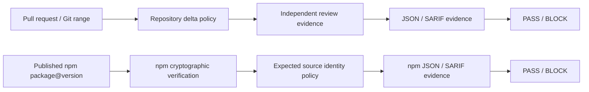
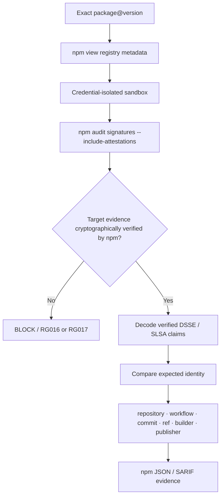
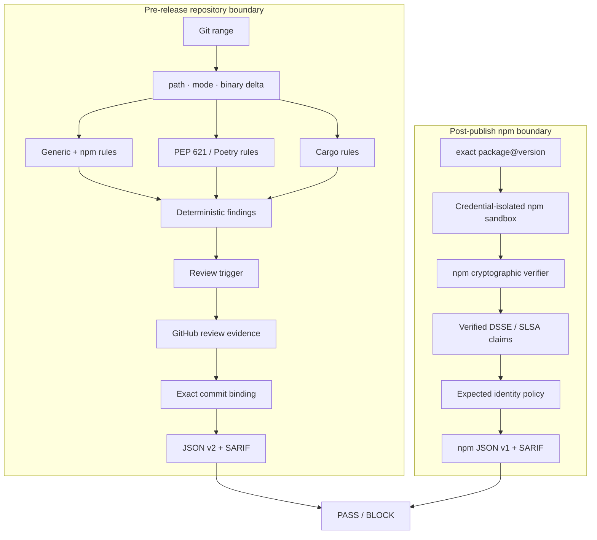

<div align="center">

# 🛡️ ReleaseGuard

### Deterministic release security · review authorization · npm provenance

**Make high-leverage release changes prove themselves before code or packages move forward.**

[](https://github.com/jerry0327/ReleaseGuard/actions/workflows/ci.yml)
[](https://github.com/jerry0327/ReleaseGuard/releases)

[](LICENSE)


### No LLM decides `PASS` or `BLOCK`.

Policy is explicit. Findings are deterministic. Evidence is reviewable.

**[Trust model](#three-trust-boundaries)** · **[Rules](#34-stable-rules)** · **[PR gate](#pull-request-gate)** · **[npm provenance](#npm-post-publish-provenance-gate)** · **[Security](#security-model)**

</div>

---

ReleaseGuard is a **software-supply-chain release gate** for GitHub-based projects. It examines the parts of a release that can silently change *who runs code, where dependencies come from, who authorized a risky change, and what source identity actually produced a published npm package*.

It deliberately separates three different security questions:



> [!IMPORTANT]
> ReleaseGuard is a guardrail, not a replacement for protected branches, trusted publishing, CODEOWNERS, isolated builds, registry security, or source review. Its goal is to make selected release invariants explicit and machine-enforceable.

## Why ReleaseGuard exists

Many supply-chain incidents do not require thousands of suspicious lines. A tiny release delta can have disproportionate power:

- one new `postinstall` hook;
- one dependency redirected to Git or a local path;
- one changed release workflow;
- one executable bit;
- one `build.rs`;
- one stale approval reused after code changed;
- one package published from the wrong workflow or commit.

ReleaseGuard treats those as **review boundaries**, not as generic code-quality signals.

| Question | ReleaseGuard asks |
| --- | --- |
| **What changed?** | Did the Git delta add execution, dependency redirection, binaries, build hooks, source overrides, release-control changes, or unusual release size? |
| **Who authorized it?** | If configured, are there enough fresh independent approvals from trusted reviewers for the *exact scanned commit*? |
| **What was published?** | Did npm cryptographically verify the exact package evidence, and does the verified provenance identify the expected repository, workflow, commit, ref, and builder? |

## Three trust boundaries

### 1. Repository delta

ReleaseGuard extracts a concrete Git range and inspects:

- changed paths and rename-aware status;
- binary changes;
- executable-mode transitions;
- npm package metadata;
- PEP 621 / Poetry dependencies and build systems;
- Cargo dependencies, overrides, build scripts, and native-link metadata;
- release-control paths and configured lockfile / changelog expectations.

Repository scanning itself is **offline**. Network access is not required unless review evidence or npm provenance verification is explicitly used.

### 2. Review authorization

When a finding reaches the configured review trigger, ReleaseGuard can query GitHub PR review evidence and require a fresh independent quorum.

It can exclude:

- PR-author self-approval;
- bot approval;
- untrusted author associations;
- stale approval for an older commit;
- approval invalidated by a later `CHANGES_REQUESTED` decision.

The scan range is then bound to the PR's observed base/head. If the scanned head is not the current PR head, `RG014` blocks reuse of approval evidence across the unverified commit boundary.

### 3. Published npm provenance

After `npm publish`, ReleaseGuard can verify an exact `package@version` before deployment or announcement.

The cryptographic boundary is intentionally delegated to the **official npm CLI**. ReleaseGuard does not implement a partial Sigstore verifier.



Only claims from **target-package evidence that npm reports as verified** are considered for identity policy.

---

## 34 stable rules

ReleaseGuard currently exposes stable rule IDs `RG001`–`RG034`.

| Range | Security surface | Examples |
| --- | --- | --- |
| `RG001–RG011` | Git + npm release delta | protected workflow changes, binaries, executable bits, install hooks, remote deps, changelog/lockfile consistency |
| `RG012–RG014` | Review authorization | insufficient quorum, unavailable review evidence, commit mismatch |
| `RG015–RG025` | Published npm provenance | missing provenance, crypto failure, trusted publisher, repository/workflow/commit/ref/builder mismatch |
| `RG026–RG029` | Python packaging | URL/VCS/path dependencies, new deps, build backend/requirements, dynamic dependency fields |
| `RG030–RG034` | Cargo + fail-closed parsing | Git/path deps, new crates, build scripts, registry/patch/replace overrides, malformed TOML |

### High-leverage examples

| Rule | Severity | Trigger |
| --- | ---: | --- |
| `RG004` | **Critical** | npm `preinstall`, `install`, or `postinstall` changed |
| `RG006` | **Critical** | npm dependency redirected to Git / URL / file / link source |
| `RG014` | **Critical** | scanned commit range and review evidence do not match |
| `RG016` | **Critical** | npm rejected registry signature / attestation evidence |
| `RG019–RG021` | **Critical** | verified package provenance names the wrong repo / workflow / commit |
| `RG026` | **Critical** | Python dependency or build requirement moves to URL / VCS / local path |
| `RG030` | **Critical** | Cargo dependency moves to Git / local path |
| `RG033` | **Critical** | custom registry / `[patch]` / `[replace]` source override introduced |
| `RG034` | **Critical** | changed supported TOML cannot be parsed, preventing safe inspection |

The full rule catalogue includes severity, rationale, remediation, and false-positive guidance in [`docs/rules.md`](docs/rules.md).

### Fail closed where inspection matters

For supported Python and Cargo manifests, a changed `pyproject.toml` or `Cargo.toml` that cannot be parsed does **not** silently skip ecosystem analysis. It becomes critical `RG034`.

This is a deliberate design choice: inability to inspect a security boundary is itself evidence that the release gate could not safely complete that inspection.

---

## Deterministic risk score — not an AI score

ReleaseGuard exposes a `risk-score` from 0–100 for summaries and Action outputs, but the score is a deterministic presentation layer.

```text
no findings → 0
low         → 10–39
medium      → 40–69
high        → 70–99
critical    → 100
```

Within the highest-severity band, additional findings add a fixed amount up to that band's ceiling.

**`PASS` / `BLOCK` is not decided by the numeric score.** It is decided by whether any finding reaches the configured `fail_on` severity threshold.

That keeps the policy explainable:

```text
same Git diff + same config + same evidence → same findings → same decision
```

---

## Pull-request gate

### CLI

Python **3.11+** is required. The Python runtime has no third-party package dependency.

Install the current GitHub release wheel:

```bash
python -m pip install \
  https://github.com/jerry0327/ReleaseGuard/releases/download/v0.4.0/releaseguard-0.4.0-py3-none-any.whl
```

Scan an explicit release range:

```bash
releaseguard scan --base origin/main --head HEAD
```

By default it writes:

```text
releaseguard-report.json   # schema version 2
releaseguard.sarif         # SARIF 2.1.0
```

Exit contract:

| Exit | Meaning |
| ---: | --- |
| `0` | Policy completed and passed |
| `2` | Policy completed and blocked the release |
| `3` | ReleaseGuard could not complete the requested operation |

### GitHub Action

```yaml
name: release-guard

on:
  pull_request:

permissions:
  contents: read
  pull-requests: read

jobs:
  releaseguard:
    runs-on: ubuntu-latest
    steps:
      - uses: actions/checkout@3d3c42e5aac5ba805825da76410c181273ba90b1 # v7.0.1
        with:
          fetch-depth: 0

      - uses: jerry0327/ReleaseGuard@v0.4.0
        with:
          config: releaseguard.toml
          github-token: ${{ github.token }}
```

> [!TIP]
> The version tag is convenient for evaluation. For a production security gate, pin ReleaseGuard and every other third-party Action to a reviewed full commit SHA.

The primary Action exposes:

- `decision`
- `risk-score`
- `findings`
- `report-path`
- `sarif-path`

This repository also **dogfoods its own Action** on pull requests and uploads JSON + SARIF evidence as workflow artifacts.

## Policy configuration

Default policy values are deliberately conservative but not maximally blocking:

```toml
[releaseguard]
fail_on = "critical"
max_changed_files = 200
```

Built-in defaults also track common manifests, lockfiles, changelog paths, protected workflow / ownership / publish-control paths, and a narrow binary allowlist for docs/assets.

### Independent review policy

Review quorum is opt-in. Example:

```toml
[releaseguard.review]
minimum_independent_approvals = 1
required_on = "high"
allow_stale_approvals = false
exclude_bots = true
fail_closed = true
allowed_author_associations = ["OWNER", "MEMBER", "COLLABORATOR"]
trusted_reviewers = []
```

When triggered, ReleaseGuard uses the reviewer's **latest decisive state** (`APPROVED`, `CHANGES_REQUESTED`, `DISMISSED`) rather than simply counting every historic approval record.

If required evidence cannot be retrieved, `fail_closed = true` emits critical `RG013`; setting it false lowers the finding to high, but does not pretend evidence was successfully collected.

Read [`docs/review-evidence.md`](docs/review-evidence.md) before making review quorum a blocking organization policy.

---

## npm post-publish provenance gate

The second reusable Action lives at `actions/verify-npm`.

```yaml
- uses: jerry0327/ReleaseGuard/actions/verify-npm@v0.4.0
  with:
    package: ${{ steps.package.outputs.name }}
    version: ${{ steps.package.outputs.version }}
    repository: ${{ github.repository }}
    workflow: .github/workflows/publish.yml
    commit: ${{ github.sha }}
    ref: ${{ github.ref }}
```

### What it verifies

Before identity policy runs, ReleaseGuard requires an npm version capable of returning the needed verified bundles. The library minimum is **npm 11.12.0**; the reusable Action currently installs an exact **npm 11.19.0** verifier.

The verifier then checks:

1. exact npm package name + exact SemVer;
2. registry metadata for that exact version;
3. provenance advertisement;
4. expected GitHub trusted-publisher marker, unless explicitly relaxed;
5. npm registry signature / attestation verification;
6. supported in-toto / SLSA statement structure;
7. signed package subject PURL + SHA-512 digest;
8. expected repository;
9. expected workflow;
10. expected full source commit SHA;
11. optional expected branch / tag ref;
12. expected SLSA builder identity;
13. presence of a recognized registry publish / release attestation.

### Credential-isolated verification sandbox

The npm path is intentionally hostile to inherited process state:

- new temporary HOME / cache / temp directories;
- empty npm user + global config files;
- caller auth tokens and arbitrary npm config are not inherited;
- `NODE_OPTIONS` and `NODE_PATH` are not inherited;
- package scripts are disabled;
- bin links are disabled during target installation;
- optional dependencies are omitted;
- JSON output is bounded to 16 MiB;
- stderr is bounded / redacted;
- DSSE payloads are bounded to 2 MiB;
- verified attestation bundles are bounded to 64;
- command timeout and retry count are bounded.

This prevents the *verification process itself* from casually turning package inspection into package execution.

### SLSA normalization

ReleaseGuard currently understands npm-verified SLSA **v1** and **v0.2** source identity. When compatible v1 and v0.2 statements are both present, v1 is preferred. Conflicting verified source identities are rejected instead of arbitrarily selecting one.

The report intentionally records normalized claims, **not** raw DSSE bundles, certificates, package contents, registry credentials, or transparency-log records.

### npm outputs

The reusable verifier exposes:

- `decision`
- `risk-score`
- `findings`
- `cryptographic-status`
- `observed-repository`
- `observed-workflow`
- `observed-commit`
- `report-path`
- `sarif-path`

The JSON report uses schema version 1; SARIF findings use npm PURLs such as `pkg:npm/...@version` as artifact locations.

See [`docs/npm-provenance.md`](docs/npm-provenance.md) and [`docs/npm-provenance-report.md`](docs/npm-provenance-report.md).

---

## Architecture



### Core modules

| Module | Responsibility |
| --- | --- |
| `git.py` | Git range, path, rename, binary and file-mode extraction |
| `rules.py` | generic / npm delta rules + orchestration |
| `ecosystems.py` | dependency-free TOML analysis for Python / Poetry / Cargo |
| `github_evidence.py` | PR context, review filtering, API safety and commit binding |
| `npm_registry.py` | exact-version public registry metadata + trusted-publisher evidence |
| `npm_verify.py` | isolated install + delegated npm cryptographic verification |
| `npm_attestations.py` | bounded verified DSSE decoding + SLSA v1/v0.2 normalization |
| `npm_policy.py` | signed subject / repository / workflow / commit / ref / builder policy |
| `npm_runtime.py` | strict inputs, safe subprocess environment, limits / redaction |
| `models.py` | deterministic decision, score and evidence structures |
| `report.py` | JSON + GitHub Step Summary |
| `sarif.py` | SARIF 2.1.0 + deterministic fingerprints |

---

## Evidence model

### Repository scan

`releaseguard-report.json` uses schema version **2** and records:

- tool version;
- exact base / head SHA;
- `PASS` / `BLOCK`;
- risk score;
- blocking threshold;
- changed-file count;
- deterministic findings;
- review evidence when applicable.

### npm provenance

`releaseguard-npm-report.json` uses schema version **1** and separates:

- expected release identity;
- cryptographic evidence status;
- normalized observed provenance identity;
- trusted-publisher metadata;
- findings + remediation.

JSON schemas are versioned under [`schemas/`](schemas/).

### SARIF

Both gates produce SARIF 2.1.0 with:

- stable `ruleId`;
- mapped severity;
- remediation text;
- deterministic partial fingerprints;
- Git source paths or npm PURL locations;
- decision / score / evidence metadata.

---

## CI + release engineering

### CI

The repository tests Python **3.11, 3.12 and 3.13** on Ubuntu. Each matrix job runs:

```text
release consistency
→ full unittest suite
→ compileall
→ build wheel
→ force-install built wheel
→ releaseguard --version
```

The test suite separately exercises:

- generic release rules;
- Python / Cargo ecosystem rules;
- independent review evidence;
- CLI integration;
- npm provenance core behavior;
- npm provenance security boundaries;
- npm subprocess integration;
- npm reporting / SARIF;
- Action metadata;
- release readiness and workflow invariants.

### Release-readiness gate

`scripts/release_check.py` validates:

- version agreement across `pyproject.toml`, `releaseguard.__version__`, and `CITATION.cff`;
- matching changelog section;
- optional release tag == `v<version>`;
- required governance / security / schema files;
- **every external Action reference is pinned to a full 40-character commit SHA**.

### GitHub Release flow

The release workflow supports an owner-controlled bootstrap branch or an existing exact `vX.Y.Z` tag. It:

1. validates exact SemVer release intent;
2. verifies a bootstrap branch points to current `main`;
3. creates or validates an immutable tag;
4. reruns release readiness, unit tests, and compile checks;
5. builds the wheel;
6. creates a tagged source ZIP;
7. generates `SHA256SUMS`;
8. publishes the GitHub Release if one does not already exist;
9. removes the temporary bootstrap branch after success.

Current release **v0.4.0** contains the wheel, tagged source archive, and checksum manifest.

---

## Security model

ReleaseGuard's security goals are deliberately narrower than “detect malicious code.”

### It aims to detect or gate

- newly introduced install-time / build-time execution;
- dependency source redirection;
- opaque binary changes;
- release-control changes;
- independent-review policy failures;
- stale / self / bot / untrusted approval reuse;
- mismatched review commit evidence;
- missing or invalid npm provenance;
- verified package provenance bound to an unexpected release identity;
- malformed supported manifests or evidence that would otherwise bypass inspection.

### It does not prove

- GitHub, npm, Sigstore, TLS, runner, or OS integrity;
- source-code correctness;
- absence of vulnerabilities;
- reproducibility of arbitrary binaries;
- exactly which human intent produced a change;
- safety if every repository control is disabled by an administrator;
- safety against collusion by all trusted reviewers;
- private-registry provenance verification;
- native PyPI attestation verification in `0.4.0`.

For npm verification, the defender is explicitly trusting the selected npm binary, Node runtime, npm registry, Sigstore trust infrastructure, GitHub Actions identity claims, network path, and runner OS.

Read the complete [`docs/threat-model.md`](docs/threat-model.md) and [`SECURITY.md`](SECURITY.md).

---

## Development

```bash
git clone https://github.com/jerry0327/ReleaseGuard.git
cd ReleaseGuard

make check
make test
make build
```

Or run the underlying checks directly:

```bash
python scripts/release_check.py
python -m unittest discover -s tests -v
python -m compileall -q releaseguard tests scripts
python -m pip wheel . --no-deps --wheel-dir dist
```

## Repository anatomy

```text
releaseguard/
├── cli.py                    scan + verify-npm CLI
├── config.py                 policy configuration
├── git.py                    release-delta extraction
├── rules.py                  generic/npm rule orchestration
├── ecosystems.py             Python / Poetry / Cargo security rules
├── github_evidence.py        trusted review + commit binding
├── npm_registry.py           exact package metadata
├── npm_verify.py             delegated cryptographic verification
├── npm_attestations.py       verified SLSA claim extraction
├── npm_policy.py             expected identity policy
├── npm_runtime.py            safe npm execution boundary
├── models.py                 decisions + evidence models
├── report.py                 JSON / Markdown summaries
└── sarif.py                  SARIF 2.1.0

actions/verify-npm/           reusable post-publish npm gate
schemas/                      versioned repository/npm evidence schemas
tests/                        policy, review, npm, CLI, report, release tests
examples/                     PR / SARIF / npm integration examples
docs/                         threat model, rules, architecture, adoption docs
.github/workflows/            CI, dogfood gate, release automation
```

## Documentation map

- [`docs/architecture.md`](docs/architecture.md) — trust boundaries and module map
- [`docs/threat-model.md`](docs/threat-model.md) — security goals / assumptions / exclusions
- [`docs/rules.md`](docs/rules.md) — RG001–RG034 semantics
- [`docs/policy-reference.md`](docs/policy-reference.md) — configuration reference
- [`docs/review-evidence.md`](docs/review-evidence.md) — independent-review model
- [`docs/npm-provenance.md`](docs/npm-provenance.md) — npm verification architecture
- [`docs/report-schema.md`](docs/report-schema.md) — repository scan evidence
- [`docs/npm-provenance-report.md`](docs/npm-provenance-report.md) — package evidence contract
- [`docs/sarif.md`](docs/sarif.md) — Code Scanning integration
- [`docs/demo.md`](docs/demo.md) — reproducible malicious-release walkthrough
- [`docs/adoption-guide.md`](docs/adoption-guide.md) — staged rollout guidance
- [`RELEASING.md`](RELEASING.md) — maintainer release process

## Project maturity

ReleaseGuard is currently **0.4.0 alpha**. It is maintained as an early open-source security project and deliberately does not claim downloads, deployments, contributors, or ecosystem adoption that cannot be independently demonstrated.

The practical recommendation is staged adoption:

1. run informationally and retain evidence;
2. tune legitimate project-specific policy;
3. enable blocking thresholds;
4. enable independent review quorum where appropriate;
5. add post-publish provenance verification before package promotion.

## Contributing + governance

- [`CONTRIBUTING.md`](CONTRIBUTING.md)
- [`GOVERNANCE.md`](GOVERNANCE.md)
- [`MAINTAINERS.md`](MAINTAINERS.md)
- [`CODE_OF_CONDUCT.md`](CODE_OF_CONDUCT.md)
- [`SECURITY.md`](SECURITY.md)
- [`SUPPORT.md`](SUPPORT.md)
- [`ROADMAP.md`](ROADMAP.md)

## License + citation

**MIT License.** See [`LICENSE`](LICENSE).

Citation metadata is available in [`CITATION.cff`](CITATION.cff).

---

<div align="center">

### Inspect the delta. Bind the review. Verify the artifact.

**ReleaseGuard**

</div>
